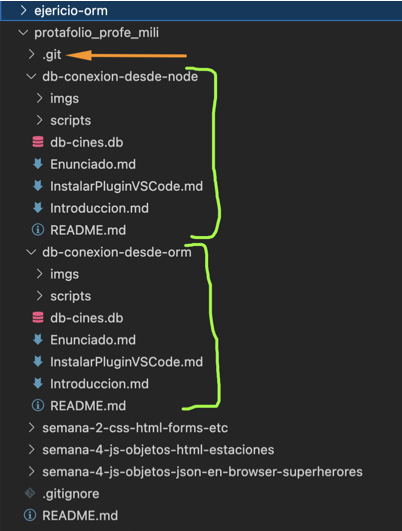
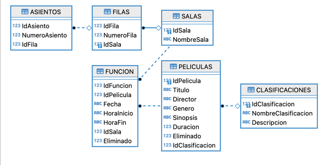

# Enunciado Práctica ORM con node - Desarrollo de Software

## Objetivo
1. Entender uso de ORM de tablas `PELICULAS` y `CLASIFICACIONES` en clases.
2. Ejercitar node con ORM (object-relational mapping)
3. Leer [Introducción a ejercicio](./Enunciado.md#introducción-a-ejercicio)
3. Resolver el ejericio propuesto en [Ejercitación propuesta](./Enunciado.md#dominio-del-problema) y pushear su portafolio


## Configuración previa

1. Clonar repositorio con enunciado: `https://labsys.frc.utn.edu.ar/gitlab/desarrollo-de-software1/materiales/ejercicios/ejericio-orm`
    RAMA base: main
    ```
    $ git clone <URL-REPO>
    ```
    ```
    $ cd REPO
    ```

2. Crear dos carpeta nuevas en su portafolio y copiar el contenido

    
> Verifiquen que no quede la carpeta oculta `git` adentro de la carpeta `ejercicio-orm` sino su repositorio `portafolio` se **rompe**


## Dominio del problema

Se desea crear un sistema para un cine que permita gestionar las películas que se proyectan y los horarios de las funciones. Para ello, se necesitan varias tablas relacionadas entre sí
    


> Pueden encontrar en la carpeta scripts los archivos `.sql` necesarias para el armado de la base de datos y la carga de varios datos a sus tablas.

## Plugin VSCode
Abrir en otra pestaña [Aquí](https://labsys.frc.utn.edu.ar/gitlab/desarrollo-de-software1/materiales/ejercicios/configuraciones-de-ayuda/-/blob/main/InstalarPluginVSCode.md)

