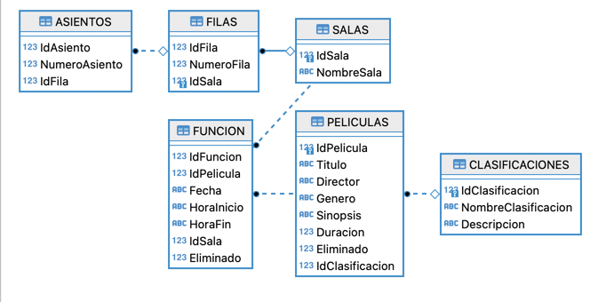

# Enunciado Práctica ORM con node - Desarrollo de Software

## Objetivo
1. Ejercitar node con ORM (object-relational mapping)

3. Resolver el [dominio del problema](#dominio-del-problema) y pushear su portafolio


## Configuración previa
1. Clonar repositorio con enunciado: `https://labsys.frc.utn.edu.ar/gitlab/desarrollo-de-software1/materiales/ejercicios/ejericio-orm`
    RAMA base: main
    ```
    $ git clone <URL-REPO>
    ```
    ```
    $ cd REPO
    ```
2. Copiar el contenido en un carpeta que se llame `db-orm-cine-extendido` en su `portafolio `
> Verifiquen que no quede la carpeta oculta `git` adentro de la carpeta `ejercicio-orm` sino su repositorio `portafolio` se **rompe**


## Introducción a ejercicio

Importantel leer la siguiente [introducción](Introduccion.md).

Ahora, con estos conceptos introducidos, les pedimos que realicen el modelo de las tablas, su definicion en la base de datos y algunas funciones declaradas en el siguiente enunciado:

## Ejercitación propuesta

Se desea crear un sistema para un cine que permita gestionar las películas que se proyectan y los horarios de las funciones. Para ello, se necesitan varias tablas relacionadas entre sí.
     

Se desea que el sistema permita:

- Listar todas las películas y funciones en cartelera.
- Buscar películas por título o género.
- Ver los detalles de una película, incluyendo las funciones en las que se proyecta y sus horarios.
- Agregar, modificar y eliminar películas y funciones.

Para implementar estas funcionalidades, se pueden utilizar las funciones de Sequelize que se vieron en clase, como findAll(), findOne(), create(), update() y destroy().

> Pueden encontrar en la carpeta scripts los archivos `.sql` necesarias para el armado de la base de datos y la carga de varios datos a sus tablas.