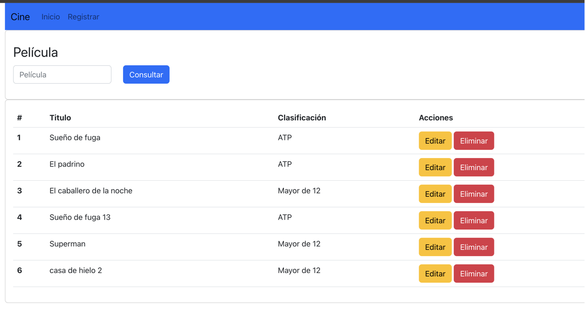

# Práctica de Integrar front y back usando llamadas HTTP por medio de axios

## Ejecicios
1. Integrar la pantalla de inicio para que consulte al back las películas y las muestre en la grilla de películas (get películas a la API).
2. Hacer funcional el filtro de la consulta de películas por `titulo` (get con query params a la API).
3. Registrar una nueva película  (post a la API).
4. Editar pelicula existente (getById y put a la API).
5. Borrar pelicula  (delete a la API)
6. *Opcional* Agregar en back y/o front lo que correponda para que almacene y se muestres los input que se muestran en la patalla de registro. 
    - Fecha de ingreso
    - Duración (mins)

## Colección postman de API 
```
https://api.postman.com/collections/1880332-616c0526-fe84-4c51-aa91-f40d30d657c7?access_key=PMAT-01JAVY6JGJMTMQYMGCCA41RQ1G
```

## Front propuesto
> No estan obligado a hacerlo igual, pueden jugar con los estilos.



## Solución propuesta 
En la rama main de este mismo repositorio

## Material
- Bootstrap con react -> https://react-bootstrap.netlify.app/docs/components/navbar/#pricing
- React tutorial -> https://react.dev/learn/tutorial-tic-tac-toe
- Web articulos -> https://labsys.frc.utn.edu.ar/dds-react/ 
- API articulos -> https://labsys.frc.utn.edu.ar/dds-express/
